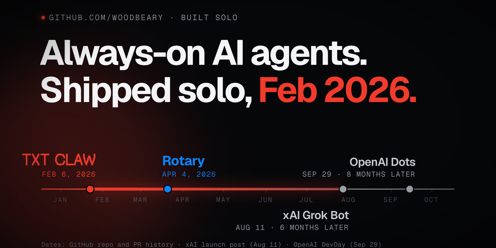

## Jacob Lopez

AI product engineer. I build agents that work for people: always on, reachable by text, on real phone lines, and on the device when there's no network.

- **[TXT CLAW → Rotary](https://github.com/woodbeary/rotary)** (Feb–Apr 2026). Always-on agents with their own cloud computer that you reach by text, then a native iPhone app where agents call and text for you. Shipped six months before xAI's Grok Bot.
- **Caption glasses.** Live captions on smart glasses for my Deaf dad, fully on-device: LC3 audio decoded in C, NVIDIA Parakeet speech recognition, Bluetooth LE.
- **[OpenJimmy](https://github.com/woodbeary/openjimmy-public).** An iMessage channel for OpenClaw agents on macOS.
- **3rd place, OpenAI hackathon (2024).** NVIDIA Inception member with TXT CLAW.

Building since 2005, when I ran game servers and forums at age 8. 5,936 commits across 137 repositories since 2023, most of it private product and client work; ask and I'll walk you through any of it.

**Stack:** TypeScript, Swift, Python · Next.js, SwiftUI, Expo · Cloudflare Workers, Durable Objects, R2, Sandbox · OpenAI Realtime and Agents SDK, xAI Grok, OpenClaw, MCP · Twilio Voice and SMS

[jacob.com.ai](https://jacob.com.ai) · jacob@lopez.com.ai · [LinkedIn](https://www.linkedin.com/in/imjacoblopez) · [X](https://x.com/imjacoblopez)
